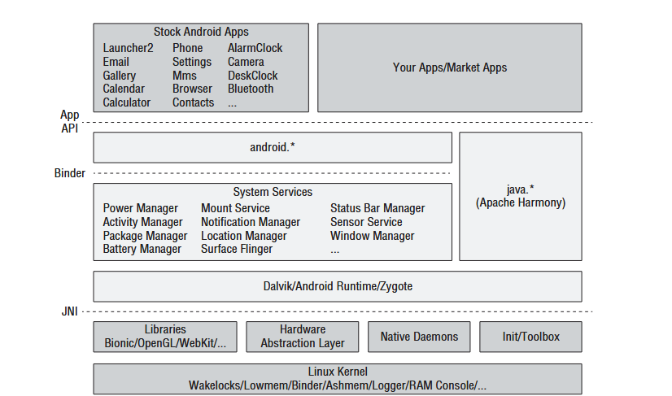

# Android Mimarisini Anlamak
Android’in genel mimarisi beş ana katmandan oluşan bileşenleri içerir:
- Android applications 
- Android Framework 
- Android Run Time
- Linux kernel

### Android Applications
Android application en üst katmanda bulunan ve diğer tüm katmanlardan yararlanarak 3. parti uygulamaları çalıştıran katmandır. Her uygulama kendi sandbox’ında çalışır.

### Android Framework
Android framework, geliştiricilere bir Android cihazın sunduğu tüm olanaklara erişim sağlayan bir API sunar. Yani uygulamalar ile Dalvik arasında iletişimi sağlar. Uygulamalar bildirim göndermek veyaa konum hizmetlerine erişmek gibi işlemler için framework ile iletişime geçerler.

### Android Run Time
ART, Java/Kotlin kodunu bytecode’dan makine koduna çevirir. Her uygulama kendi ART sürecinde çalışır yani sandboxing yapar.

#### Kütüphaneler
Android, C/C++ ile yazılmış sistem kütüphanelerini içerir: SQLite, OpenSSL, WebKit vb. Uygulamalar genellikle bu kütüphanelere JNI ile bağlanır.

### Linux Kernel
En alt katmandır. Donanım ile birebir iletişime geçer.

## Android Sandbox
Her uygulama kendi UID ile çalışır. Dosya sistemi erişimi diğer uygulamalardan izole edilmiştir. Normal permissions otomatik olarak verilir. Dangerous permissions kullanıcıdan runtime onayı gerekir. Keystore ile şifreli veri saklanabilir.